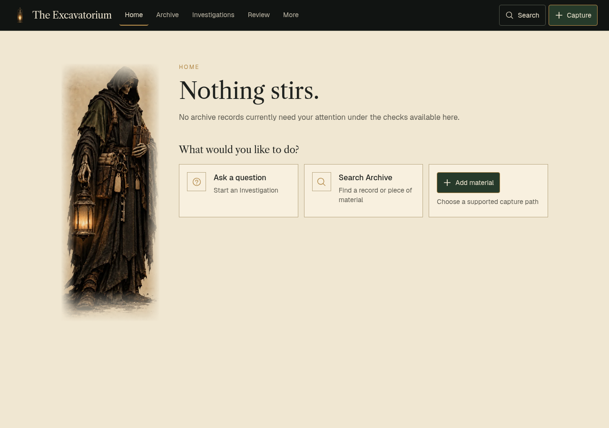

<p align="center">
  
</p>

# The Excavatorium

**The Archive remembers. The Custodian examines. The Owner decides.**

The Excavatorium is an owner-controlled archive and judgment layer for AI.

Save the things that matter — conversations, documents, decisions, tools, repositories, and the context around them — into a durable private Archive. Then let the Custodian examine a bounded set of that evidence, without ever silently turning model output into truth.

**[Open the live beta →](https://the-excavatorium.lovable.app)**

> **Public beta.** The core loop works and is in daily use, and it is still rough around the edges. See [Beta limitations](#beta-limitations).

<p align="center">
  
</p>
<p align="center"><sub>A new account: a private Archive that starts empty. No sample data, no shared content.</sub></p>

## Why it exists

AI work piles up in places that forget. A useful conversation is buried in a chat history, a decision loses its reasons, a document's real claims are never extracted, and every model answer sounds equally sure of itself.

The Excavatorium is built around one rule: **you keep the record, and you keep the authority.** Evidence lives in your Archive. AI reads only what you select. What it concludes is stored as an attributable interpretation you can accept, revise, or reject — never as fact.

## The doctrine

### The Archive remembers

A private, owner-scoped record space for **tools, repositories, conversations, decisions, and documents**. Records carry tags and optional project or route metadata *you* define, link to each other with plain-language relationships, and can be found again through search, connections, and a timeline. Nothing in it is shared, and nothing is inferred as a link unless you or a persisted rule made it.

### The Custodian examines

You open an **Investigation**: a question, the Archive records you choose as evidence, and any background context you want to add. The Custodian examines only that bounded material and returns a structured result: a conclusion, the evidence that supports it, tensions and alternatives, what is uncertain or missing, and what would change its mind. If the evidence is not there, the honest output is *unresolved*, not a confident guess.

### The Owner decides

A **Custodian Finding** is an examination output. It is recorded with the Investigation, run, model, and evidence that produced it, and it never becomes your judgment on its own. Your own decisions stay separate, and disagreeing with a Finding never erases it.

## What works today

- **Private Archive** — five record types, tags, optional owner-defined project route, per-account isolation enforced by Supabase Row Level Security.
- **Links, search, and timeline** — follow backlinks, browse connections, search across everything, and read your Archive chronologically.
- **Conversation excavation** — paste a long AI conversation and get an editable structured draft: findings, decisions, open loops, reusable prompts. Nothing is saved until you apply and save it.
- **Document excavation** — upload a PDF, Markdown, or text file (up to 10 MB) and get an editable draft with cited source references. Files are stored privately.
- **Investigations and Findings** — evidence-bounded analysis with Findings kept separate from Owner Judgment.
- **Bring your own key** — provider-backed features use your own OpenAI API key.
- **Export and portability** — export your Archive, or your broader account data, and delete your account through the product.
- **MCP** — an OAuth-backed MCP server so compatible AI clients can read your own Archive within the same owner boundary.

## A first session

1. Create an account. Your Archive starts empty; no AI key is needed to use it.
2. Add a few records — paste a conversation, upload a document, note a decision — and link the ones that belong together.
3. To use AI features, open **Settings**, add your OpenAI API key, and choose a model.
4. Start an **Investigation**: write the question, select the Archive material to examine, and run the Custodian.
5. Read the Finding, check its evidence, and decide what — if anything — you want to do with it.

## Bring your own key

The Excavatorium does not provide a shared AI allowance and has no operator-key fallback. **Every provider-backed feature uses your own OpenAI API key**: Custodian Investigations, conversation excavation, and document excavation. Everything that does not contact the provider works without a key.

- Your key is encrypted on the server before it is stored, and the plaintext key is never returned to the browser.
- Requests are sent with `store: false`, one provider call per attempt, with no automatic retries.
- Usage and cost are recorded per run and shown as *known*, *held*, or *unknown* — unknown usage is never displayed as zero.
- You choose the model. The catalog is GPT-5.6 (Luna, Terra, Sol) and GPT-6 (Luna, Sol, Astra). Whether a model works depends on what your own OpenAI project can access.

## Privacy and security

- Each account has its own Archive. Row Level Security and owner-scoped Edge Functions keep it separate from every other account.
- Uploaded files live in private storage under your account.
- Provider secrets, wrapping keys, and service credentials are server-side only and are never placed in browser configuration.
- Findings stay attributable to the Investigation, run, model, and evidence that produced them, and evidence links are validated against the material you selected.

For vulnerability reports, follow [SECURITY.md](./SECURITY.md) rather than posting details publicly.

## MCP

The Excavatorium includes an OAuth-backed MCP integration. After you connect your account, a compatible client can retrieve your own Archive data and use the available tools within the same owner boundary. Some Custodian actions are deliberately not exposed through MCP yet. See [plugins/the-excavatorium/README.md](./plugins/the-excavatorium/README.md) for the current tool surface and setup.

## Beta limitations

This is a real beta, not a finished commercial product.

- The interface and workflows are still being refined, and the data model and integrations may change.
- Accounts are single-owner: there are no teams, shared Archives, billing, or social login.
- AI features require your own OpenAI API key, and their quality depends on the model and evidence you provide.
- Some Custodian controls exposed through MCP are intentionally unavailable.

If something breaks, please open an issue.

## Run it locally

Requirements: [Bun](https://bun.sh), the [Supabase CLI](https://supabase.com/docs/guides/cli), and a Supabase project or local Supabase stack.

```sh
bun install
bun run dev
```

The app runs at `http://localhost:8080`. Browser configuration uses only public Supabase values:

```sh
VITE_SUPABASE_URL=https://<your-project-ref>.supabase.co
VITE_SUPABASE_PUBLISHABLE_KEY=sb_publishable_...
```

Never put service-role keys, OpenAI keys, wrapping keys, database passwords, or other secrets in browser environment variables or committed files.

More detail:

- [Public beta / production readiness](./docs/public-readiness.md)
- [Supabase setup](./docs/supabase-setup.md)
- [Supabase verification](./docs/supabase-verification.md)
- [Custodian program](./docs/custodian-program.md)

## Contributing

Bug reports, ideas, and pull requests are welcome. Please read [CONTRIBUTING.md](./CONTRIBUTING.md) first.

## License

The Excavatorium is **source-available** under the [Business Source License 1.1](./LICENSE). It is **not** OSI open source. Personal, non-commercial use and internal use within your own organization are covered by the Additional Use Grant; the [license](./LICENSE) sets out the commercial-use terms, the Change Date, and the eventual Apache-2.0 change license.
