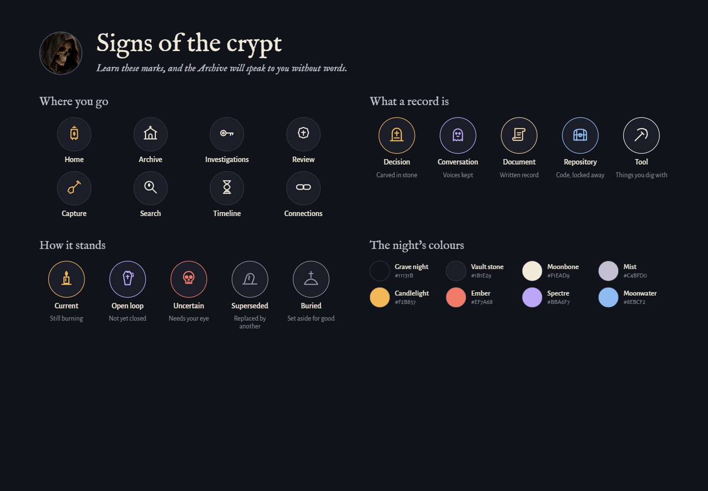
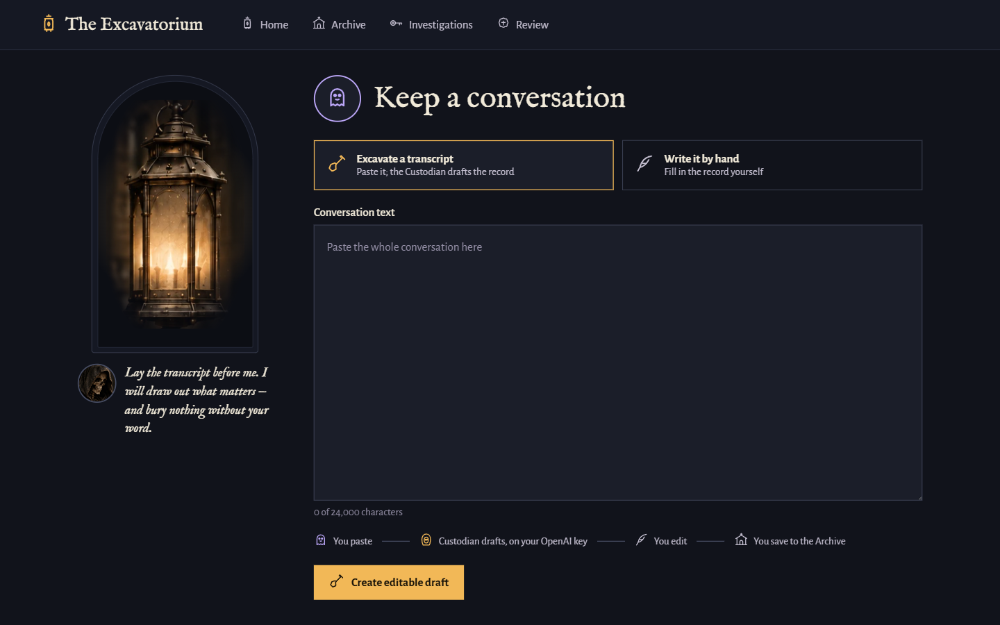

<p align="center">
  
</p>

# The Excavatorium

**The Archive remembers. The Custodian examines. The Owner decides.**

The Excavatorium is an owner-controlled archive and judgment layer for AI. Keep the conversations, documents, decisions, tools, and repositories that matter; connect the evidence; and ask the Custodian to examine only what you select. Its Findings remain attributable interpretations, separate from your own decisions.

**[Open the live beta](https://the-excavatorium.lovable.app)**

> **Public beta.** New accounts start with an empty, private Archive. An OpenAI key is optional until you use a provider-backed feature. See [Beta limitations](#beta-limitations).

<p align="center">
  
</p>
<p align="center"><sub>Night Crypt icon and colour design reference, not a screenshot of a user's Archive.</sub></p>

## The Archive

The Archive holds five kinds of owner-authored records: **conversations, documents, decisions, tools, and repositories**. Records can carry tags and an optional project route, and you can connect related records. Search, the Connections view, and Timeline provide different ways back to the material you kept.

The Night Crypt interface is the Archive's current visual language: a dark palette, clear record and standing icons, a responsive Home and Archive, and a Custodian who speaks only in narration. The product is still **The Excavatorium**.

Records retain their own standing. A tentative decision remains tentative; a superseded decision shows what replaced it; an open conversation stays open. The interface does not turn a model's reading into an owner verdict.

## The Custodian and Investigations

An **Investigation** starts with your question and the Archive records you choose as evidence. The Custodian can examine that bounded material and save a **Finding** with its conclusion, support, contrary evidence, uncertainty, and provenance. A Finding stays linked to the Investigation and run that produced it. It does not edit a decision or record Owner Judgment for you.

You can also paste a conversation or provide a PDF, Markdown, or text document for excavation. The Custodian returns an editable draft; you review it before saving anything to the Archive. Document drafts retain source references. The conversation capture screen below shows the Night Crypt design direction.

<p align="center">
  
</p>
<p align="center"><sub>Conversation capture design reference with an empty form. It contains no personal Archive data and is not a live product screenshot.</sub></p>

## Bring your own key

Provider-backed features use **your OpenAI API key**. There is no shared AI allowance or operator-key fallback. The Archive itself works without a key. The key is encrypted server-side before storage; the browser receives masked status, not the saved plaintext key.

The current model catalog is GPT-5.6 Luna, Terra, and Sol, and GPT-6 Luna, Sol, and Astra. Availability depends on your OpenAI project. Runs show their recorded usage and cost state; an unknown cost is not presented as zero.

## Privacy, portability, and MCP

- Each account has an owner-scoped Archive enforced by Row Level Security and owner-scoped server functions. Uploaded files use private storage.
- Settings offers Archive export and import, broader account-data export, and account deletion. Account exports omit plaintext keys, wrapping keys, service credentials, and uploaded Storage binaries.
- The OAuth-protected [MCP integration](./plugins/the-excavatorium/README.md) exposes owner-scoped Archive tools to compatible clients. Some Custodian run controls are intentionally unavailable through MCP.

For vulnerability reports, use [SECURITY.md](./SECURITY.md).

## Beta limitations

- Accounts are single-owner. There are no teams, shared Archives, billing, or social login.
- Provider-backed features require your own OpenAI key, and their output depends on the model and evidence supplied.
- The interface displays the separation between Findings and Owner Judgment, but recording an Uphold, Revise, or Leave open judgment on a Finding is not yet available.
- The interface and integrations may change during beta.

If something breaks, please [open an issue](https://github.com/Troyyboii/the-excavatorium/issues).

## Run locally

You need [Bun](https://bun.sh), the [Supabase CLI](https://supabase.com/docs/guides/cli), and a Supabase project or local Supabase stack. Install dependencies and start the app:

```sh
bun install
bun run dev
```

The app runs at `http://localhost:8080`. Set only the public Supabase browser values:

```sh
VITE_SUPABASE_URL=https://<your-project-ref>.supabase.co
VITE_SUPABASE_PUBLISHABLE_KEY=sb_publishable_...
```

Keep service-role keys, OpenAI keys, wrapping keys, and database passwords out of browser variables and committed files. See [Supabase setup](./docs/supabase-setup.md), [verification](./docs/supabase-verification.md), and [public beta readiness](./docs/public-readiness.md) for the full setup and operational checks.

For the frontend checks used in this repository:

```sh
bun run mcp:manifest
bun run typecheck
bun run lint
bun run test
bun run build
```

## Contributing

Bug reports, ideas, and pull requests are welcome. Read [CONTRIBUTING.md](./CONTRIBUTING.md) first.

## License

The Excavatorium is source-available under the [Business Source License 1.1](./LICENSE), not OSI open source. The Additional Use Grant covers personal, non-commercial use and internal use within your own organization; the license states the commercial terms, Change Date, and eventual Apache-2.0 change license.
